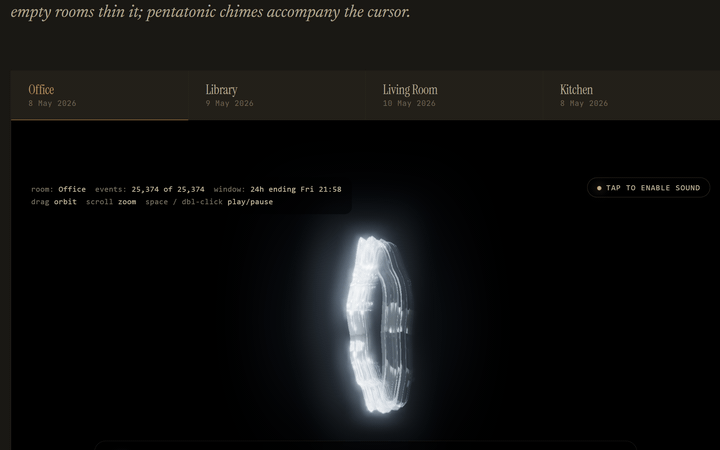

# ha-starter-kit

A pragmatic, component-based Home Assistant starter kit — extracted from a
real house that has been running all of this in production. No cloud
subscriptions required, no exotic hardware, nothing conceptual: every
component here earns its place by making daily life quietly better, and every
odd-looking number in the YAML is a lesson someone already paid for.

**Who it's for**: you have (or are about to set up) a Home Assistant install
and want working, understandable building blocks instead of a thousand
browser tabs. Each component is self-contained — install one, live with it,
come back for the next.



*Where the kit ends up: [component 16](components/16-long-take/) renders a
day of mmWave radar as a living sculpture —
[see it running live](https://haroldathome.com/the-long-take). It starts with
a £5 ESP32 and a light that turns itself on.*

## How the kit works

Everything is built on Home Assistant **packages**: one YAML file per
component containing its automations, helpers, scripts and template sensors
together. Installing a component is:

1. Copy `components/NN-name/package/*.yaml` → your `/config/packages/`
2. Rename the placeholder entities listed in that component's README
3. Add any `!secret` keys it needs to your `secrets.yaml`
4. Restart Home Assistant (or reload YAML)

A few components also ship extra artefacts beyond (or instead of) a package
file — ESPHome device configs, a dashboard, a theme, starter scenes that
merge into `scenes.yaml` — and their READMEs say exactly where each file
goes.

Never used packages before? Copy [`base/configuration.yaml`](base/configuration.yaml)
(or merge its few keys into yours) — it wires up the `packages/` directory,
themes, and UI-stub files. [`docs/getting-started.md`](docs/getting-started.md)
walks the whole path from empty hardware to first component.

## Start here

- **New to all of this?** → [docs/getting-started.md](docs/getting-started.md)
  then [docs/hardware-shopping-list.md](docs/hardware-shopping-list.md)
- **Have HA running already?** → component
  [01 (Zigbee foundation)](components/01-zigbee-foundation/) if you don't
  have Zigbee2MQTT yet, then [06 (scenes)](components/06-scenes/) or
  [02 (presence lighting)](components/02-presence-lighting/) for a
  same-evening win
- **Before you put any of this in git** → [docs/secrets-and-git-safety.md](docs/secrets-and-git-safety.md)

## Components

| # | Component | What you get | Needs |
|---|-----------|--------------|-------|
| 01 | [Zigbee foundation](components/01-zigbee-foundation/) | Zigbee2MQTT set up properly: channel choice, pairing discipline, permit-join guard, naming that won't bite you later | Zigbee USB dongle (~£20) |
| 02 | [Presence lighting](components/02-presence-lighting/) | Lights that follow people: mmWave presence with time-of-day brightness bands, manual-override toggles, shower steam timer | mmWave presence sensor(s) |
| 03 | [Heating (TRVs)](components/03-heating-trv/) | Per-room radiator schedules that check the weather forecast before firing — self-suppressing in mild weather, no seasonal toggle. Plus a 1-hour boost that puts everything back afterwards | Zigbee TRVs (~£20–25/room) |
| 04 | [Energy (Octopus Agile)](components/04-energy-octopus/) | Clean rate sensors, a rolling "cheapest 3-hour window" sensor, peak/off-peak alerts, 07:30 cost briefing | Octopus Energy + HACS integration |
| 05 | [Smart lock](components/05-smart-lock/) | Auto-unlock policy (opt-in, honestly documented), bedtime autolock, left-unlocked warnings, battery alert — and the one automation everyone should steal: **post-unlock verification** that catches the lock silently ignoring commands | Smart lock |
| 06 | [Scenes](components/06-scenes/) | Four starter scenes, a £10 4-button scene controller, and natural-language voice phrases ("warm lights", "movie mode") that run locally with zero cloud | Smart bulbs |
| 07 | [Daily rhythms](components/07-daily-rhythms/) | The house's daily pulse: light schedules where manual always wins, goodnight macro, empty-house setback, welcome-home light after dark, voice-toggled dumb plugs | What you already have |
| 08 | [ESP32 BLE presence](components/08-esphome-ble-presence/) | DIY room-level presence: £5 ESP32 Bluetooth-proxy nodes + optional £12 mmWave radar boards. The advanced one — marked "for the curious" | ESP32 boards (no soldering if you use a JST pigtail) |
| 09 | [ESPHome smart button](components/09-esphome-smart-button/) | A physical one-press button with instant beep feedback and success/failure tunes — wire it to anything | M5StickC Plus2 (~£15) |
| 10 | [Voice satellites](components/10-voice-satellites/) | Room voice control on £12 Atom Echoes: Assist pipeline, an announce script, and a pool of voice-set timers and alarms | Atom Echo(es) |
| 11 | [Wall tablet](components/11-wall-tablet/) | A wall-mounted dashboard done properly: kiosk mode, finger-sized cards via reusable style anchors, and charge cycling so the battery survives 24/7 duty | A used tablet (~£60) |
| 12 | [Guardrails](components/12-guardrails/) | The safety rails to build **before** you need them: protect a critical plug from your own automations, get told the moment HA raises a Repair, daily low-battery digest | Nothing |
| 13 | [Theme](components/13-theme/) | A warm editorial dark theme (off-black + amber, proper typography) that makes every dashboard in this kit look intentional | Nothing |

**The advanced tier** — three components that build on 08 and 10. Do those
first; come back here when the basics are boringly reliable.

| # | Component | What you get | Builds on |
|---|-----------|--------------|-----------|
| 14 | [Presence fusion](components/14-presence-fusion/) | Server-side room-level presence: BLE identifies *who*, radar confirms *bodies*, a stateful fusion sensor decides the room — with transit suppression, cross-floor cooldown, and an honest "start with the simple version" path | 08 |
| 15 | [Wake-word training](components/15-wake-word-training/) | Train a custom wake word in one Colab run and deploy it to your voice satellites — including the tuning methodology that separates a demo from a daily driver | 10 |
| 16 | [The Long Take](components/16-long-take/) | The showpiece: a 24-hour space-time sculpture of movement in a room, rendered live in the browser from radar history. Yes, it's art. The install is still pragmatic | 08 |

## The philosophy (read this once)

- **Schedules propose, humans dispose.** Every automation here leaves a way
  for a human at a switch to win. Automation that fights its household gets
  turned off within a month.
- **Guardrails before they're needed.** Your automations *will* eventually do
  something dumb at 3am. Component 12 exists so it's funny instead of costly.
- **The odd numbers are the point.** A 10-second verification delay, a 254s
  permit-join window, a 22 °C setpoint on a valve that reads 3 °C warm — the
  comments explain each one, and they're the difference between a config that
  demos well and one that runs for years.
- **`!secret` everything, from day one.** See
  [docs/secrets-and-git-safety.md](docs/secrets-and-git-safety.md). A leaked
  HA token is remote control of your house.
- **The shipped numbers are examples.** Every time, threshold and default in
  this kit is an illustrative value chosen for the documentation — not a live
  description of any particular household's schedule or security posture.
  Tune them to your house.

## Repo layout

```
base/         minimal configuration.yaml + secrets.yaml.example
components/   16 self-contained components — 13 core + 3 advanced-tier
              (README + package YAML each; some add extra files —
              ESPHome configs, dashboard, theme)
docs/         getting started, hardware list, conventions, git safety
scripts/      check-secrets.py — pre-commit secret scanner
```

## License

MIT — see [LICENSE](LICENSE). Use it, fork it, strip it for parts.
